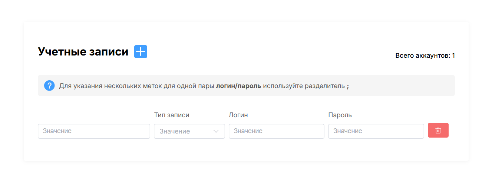

# 📘 Account Form

Приложение на **Vue 3** с использованием **Element Plus** для управления списком учётных записей.

---

## 🚀 Технологии

- [Vue 3](https://vuejs.org/)
- [TypeScript](https://www.typescriptlang.org/)
- [Element Plus](https://element-plus.org/)
- [Vite](https://vitejs.dev/)
- Composition API + Script Setup

---
<br><br>
## 🔗 Деплой демонстрационной версии

📍 https://vue-account-form.vercel.app/
<br><br>
## 🖥️ Главный экран
<p align="left">
  
</p>
<br><br>
## 📦 Установка

```bash
git clone https://github.com/arturyeszhanov/vue-account-form.git
cd vue-account-form
npm install
npm run dev
```
<br><br>

## 🗂 Структура проекта
```bash
.
├── public/
│   └── favicon.png
├── src/
│   ├── App.vue
│   ├── main.ts                         # Точка входа в приложение
│   ├── components/
│   │   ├── AccountItem.vue             # Один элемент
│   │   └── AccountList.vue             # Список всех аккаунтов
│   ├── pages/
│   │   └── AccountPage.vue             # Основная страница: заголовок, кнопка "добавить"
│   ├── stores/
│   │   └── AccountStore.ts             # Хранилище
│   ├── types/
│   │   └── Account.ts                  # Описание типа Account
│   └── validators/
│       └── AccountRules.ts             # Правила валидации для форм (Element Plus Form Rules)
├── vite.config.ts
├── tsconfig.json
├── package.json
└── README.md

```
<br>

## 📬 Контакты

- [Telegram](https://t.me/artyes26): @artyes26  
- [GitHub](https://github.com/arturyeszhanov): arturyeszhanov
